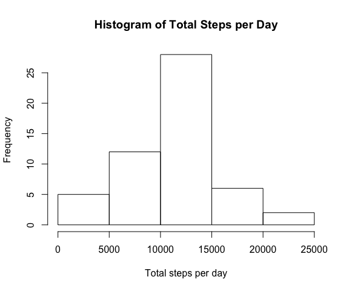

# Reproducible Research: Peer Assessment 1


## Loading and Preprocessing the Data
For this assignment, the data is loaded from the file _activity.csv_. The data are preprocessed and incomplete entries, i.e. missing values, are removed from the original dataset.


```r
# Load activity data into a data frame, dF.
dF <- read.csv("activity.csv", header=TRUE, as.is=TRUE)

# Data under the column 'date' is converted to Date type.
dF$date <- as.Date(dF$date)

# Incomplete entries, i.e. rows containing NA, are removed. 
goodDF <- dF[complete.cases(dF),]
```


## Mean Total Number of Steps Taken per Day

### Histogram
Below is a histogram of the total number of steps taken per day.


```r
# Reshape the data for total number of steps taken per day
dailySteps <- lapply(split(goodDF$steps,goodDF$date),sum)

# Histogram plot of total daily steps
hist(unlist(dailySteps), xlab="Total steps per day", 
     main = "Histogram of Total Steps per Day")
```

 

### Mean and median of total daily steps
The mean and median total number of steps taken per day are calculated as follows.


```r
# Mean
mean(as.numeric(dailySteps))
```

```
## [1] 10766.19
```

```r
# Median
median(as.numeric(dailySteps))
```

```
## [1] 10765
```

## Average Daily Activity Pattern

Below shows a time-chart of the average number of steps taken over a 5-minute inteveral during an average day.


```r
# Reshape the data to gather the average number of steps (per 5-min 
# interval) taken around the clock
dailyPattern <- lapply(split(goodDF$steps,goodDF$interval),mean)

# Time plot of the 5-minute interval mean number of steps on an 
# average day
plot(as.numeric(dailyPattern)~names(dailyPattern),type="l",
     xlab="Time of Day (24-hr)",ylab="Number of Steps", xaxt = 'n', 
     main="Average Number of Steps per 5-Minute Intervals")
axis(1, at=c('0000','0600','1200','1800','2355'))
```

 

### Time of day when greatest number of steps are taken
The output shown below represents the time of the day when the greatest number of steps is taken.


```r
names(which(dailyPattern == max(as.numeric(dailyPattern))))
```

```
## [1] "835"
```

## Imputing the Missing Values

### Missing values
Missing values in the original dataset are coded as _NA_. The output shown below gives the total number of missing values in the dataset. The missing values introduce bias to the dataset.


```r
noData <- is.na(dF)
sum(noData)
```

```
## [1] 2304
```

### Eliminating data bias
One way to eliminate the bias in the dataset is to replace each missing value with its corresponding 5-minute interval mean at the particular time of the day in which the missing value is found, i.e. the missing value's time location.


```r
# Collect the time location of the missing values
badDF.list <- row.names(dF[noData,])

# Map the 5-minute interval means to the time location of the 
# missing values
goodDF.mapped <- dailyPattern[as.character(dF[badDF.list,3])]

# Create a new dataset from the original and replace the 
# missing values with the 5-minute interval means
dF.new <- dF
dF.new[badDF.list,1] <- as.numeric(goodDF.mapped)
```

### Histogram
The histogram of the total number of steps taken per day for the new dataset is shown below.


```r
# Reshape the data for total number of steps taken per day
dailySteps.new <- lapply(split(dF.new$steps,dF.new$date),sum)

# Histogram plot of total daily steps
hist(unlist(dailySteps.new), xlab="Total steps per day", 
     main = "Histogram of Total Steps per Day")
```

 

### Mean and median of total daily steps
The mean and median total number of steps taken per day for the new dataset are calculated as follows.


```r
# Mean
mean(as.numeric(dailySteps.new))
```

```
## [1] 10766.19
```

```r
# Median
median(as.numeric(dailySteps.new))
```

```
## [1] 10766.19
```

As it can be seen, the mean total number of setps taken per day remains unchanged. The median, however, has changed. Imputing the missing data with the 5-minute interval means seems to bring the median to the mean of the data.

## Differences in Activity Patterns: Weekdays vs Weekends

### Separating out the weekday and weekend data
The function _is.weekend_ is written to separate out the data under the two categories: _weekday_ and _weekend_.


```r
is.weekend <- function(day) {
    weekend <- day == c("Saturday", "Sunday")
    weekend <- as.logical(sum(weekend))
    if (weekend == TRUE) {
        assignment <- "weekend"
    } else {
        assignment <- "weekday"
    }
    assignment
}
```

Hence, by using _sapply_, the assignment of whether a set of data falls on a weekend can be carried out conveniently. The 5-minute interval means computation is grouped by its interval and its day type assignment via the _aggregate_ function.


```r
dF.assigned <- sapply(weekdays(dF.new[,2]),is.weekend)
dF.new <- cbind(dF.new, dF.assigned)
names(dF.new)[4] <- "assignment"

# Apply mean over all intervals by aggregate
dF.means <- aggregate(dF.new$steps,
                      by=list(dF.new$interval,dF.new$assignment),
                      mean)
colnames(dF.means)<-c("interval","dayType","steps")
```

### Weekday and weekend patterns
Using the _lattice_ package, the dataset can be plotted respectively by the _weekday_ and _weekend_ groups.


```r
library(lattice)

xyplot(steps~interval|dayType, data = dF.means,
       type="l", layout=c(2,1),
       xlab="Time of day (24-hr)", ylab="Number of Steps",
       main = "Average Number of Steps per 5-Minute Intervals")
```

 

From the panel plots, one can generally observe more activity throughout the day on the _weekend_, but the greatest activity generally happens in the morning on the _weekday_.
